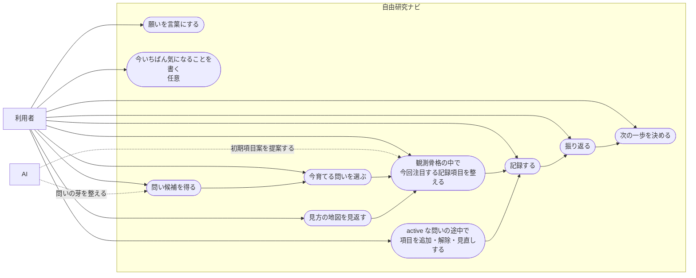
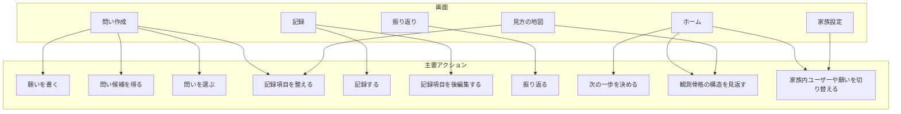
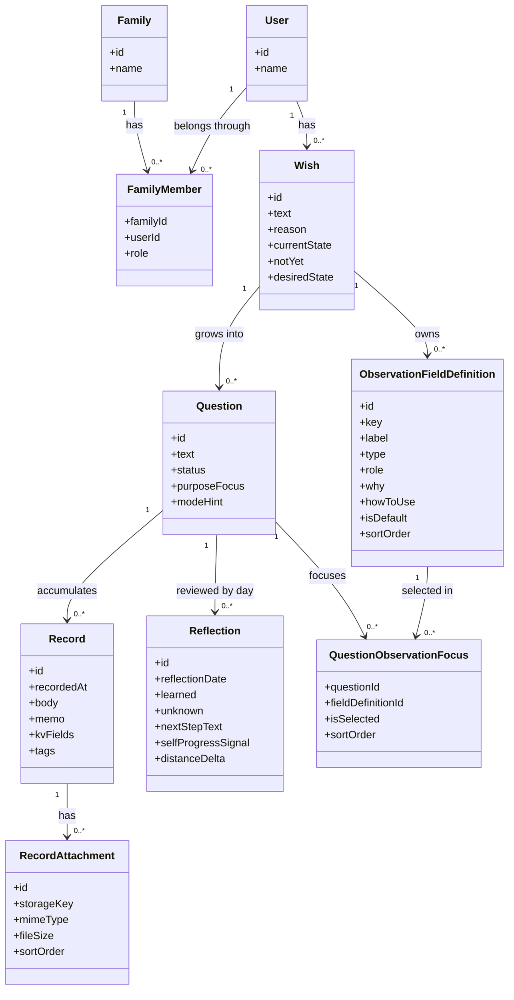
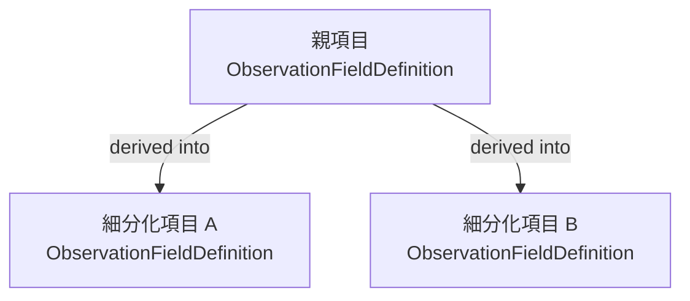
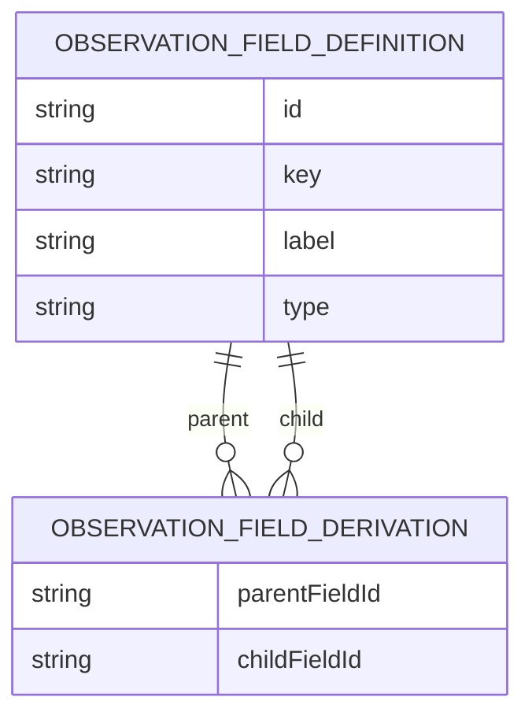
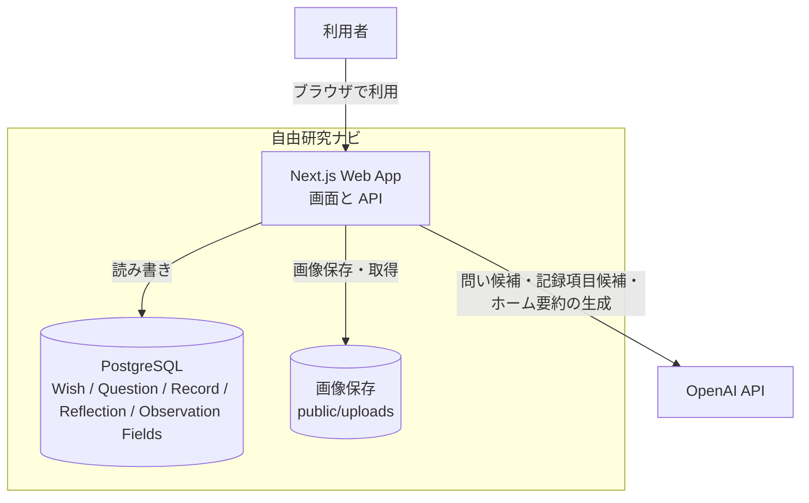

# 自由研究ナビ MVP / v1.x 補助図

この文書は、`docs/product/mvp-design.md` に書かれた現行仕様を、図で補助的に示すための文書である。  
現行仕様の正本は `docs/product/mvp-design.md` であり、この文書はその代わりではない。

## 1. ユースケース図

## 2. 画面責務図

## 3. クラス図

## 4. ObservationFieldDefinition の細分化表現案

`ObservationFieldDefinition` の親子関係は、GitHub 上の `classDiagram` では自己関連の描画が崩れることがある。  
そのため、自己関連を強調したい場合は次の代替表現を使う。

### 4.1 flowchart で表す案

### 4.2 erDiagram で表す案

## 5. C4 風の概要図

## 6. 補足

- ユースケース図では、AI は問いや記録項目の作者ではなく、整える補助役として表現している
- 画面責務図は画面遷移図ではなく、どの画面がどの責務を持つかを示す
- クラス図は実装上の全属性一覧ではなく、現行仕様の理解に必要な中心構造へ絞っている
- `ObservationFieldDefinition` の親子関係は GitHub 上の Mermaid 描画安定性を優先し、クラス図本体からは外して別図で補っている
- C4 風の概要図は MVP の把握を優先した簡略版である
